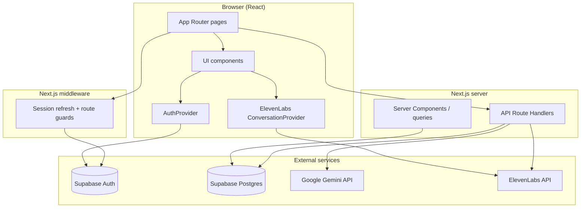
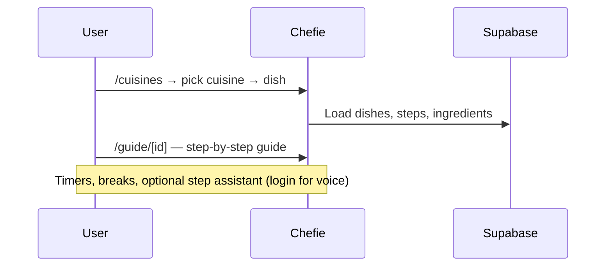
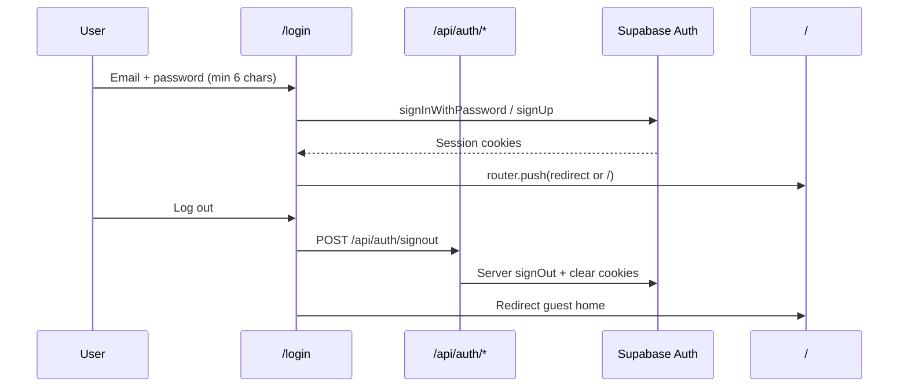
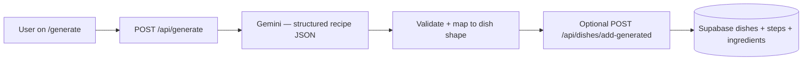
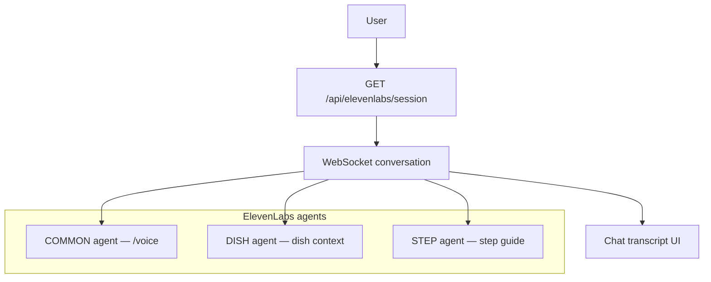
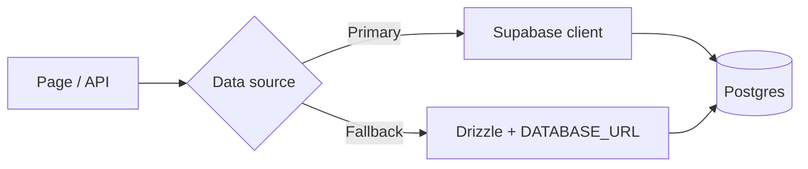
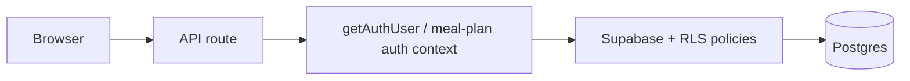
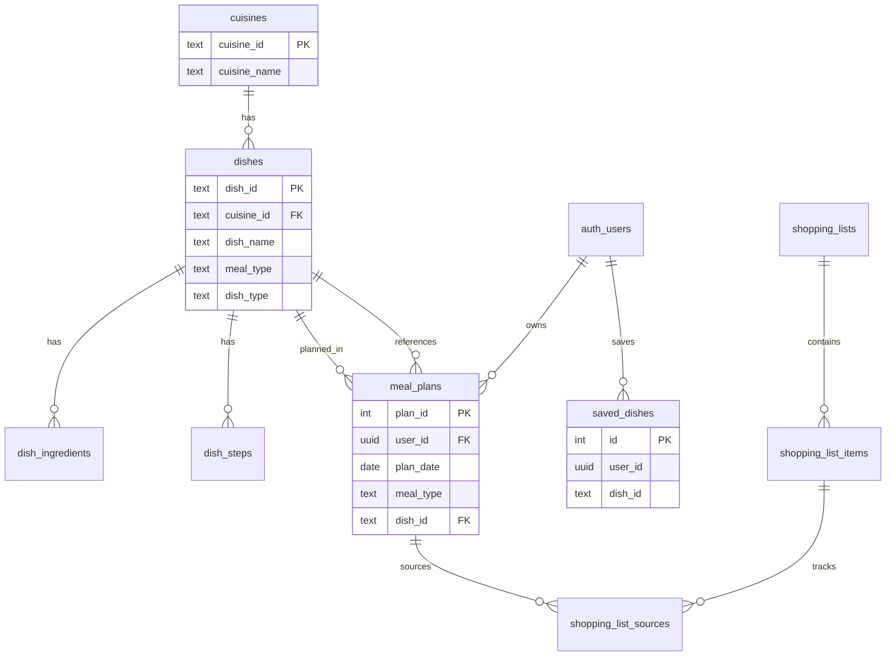

# Chefie

Chefie is a **Next.js cooking companion** for exploring cuisines, following step-by-step guides, planning meals, and getting AI help while you cook. Guests can browse recipes; signed-in users get voice guidance, AI recipe generation, meal planning, a personal library, and shopping lists.

---

## Table of contents

- [Tech stack](#tech-stack)
- [High-level architecture](#high-level-architecture)
- [Application workflows](#application-workflows)
- [Data flow](#data-flow)
- [Database model](#database-model)
- [Authentication & access control](#authentication--access-control)
- [Project structure](#project-structure)
- [Environment variables](#environment-variables)
- [Getting started](#getting-started)
- [Supabase setup](#supabase-setup)
- [Scripts](#scripts)

---

## Tech stack

| Layer | Technology | Role |
|--------|------------|------|
| **Framework** | [Next.js 16](https://nextjs.org) (App Router) | SSR, routing, API routes, middleware |
| **UI** | React 19, Tailwind CSS 4 | Components and styling |
| **Icons** | Tabler Icons | Navigation and UI icons |
| **Auth & DB (runtime)** | [Supabase](https://supabase.com) + `@supabase/ssr` | Auth sessions, Postgres, RLS |
| **ORM (optional / tooling)** | [Drizzle ORM](https://orm.drizzle.team) | Schema, migrations, seed, studio |
| **AI — recipes & text help** | Google Gemini (`@google/generative-ai`) | Generate recipes, step assistant, help API |
| **AI — voice** | ElevenLabs (`@elevenlabs/react`) | Real-time conversational agents |
| **PDF export** | jsPDF | Shopping list export |
| **Language** | TypeScript 5 | End-to-end typing |

---

## High-level architecture



**Request path (typical):**

1. User hits a page → **middleware** reads Supabase session cookies and redirects guests away from protected routes.
2. Client components call **`/api/*`** with `credentials: "include"` where auth is required.
3. API routes use **server Supabase client** (user-scoped via cookies) or **admin client** (service role, when configured) for data and **Gemini / ElevenLabs** for AI.

---

## Application workflows

### 1. Browse & cook (guest-friendly)



| Route | Access | Description |
|-------|--------|-------------|
| `/` | Public | Home, feature overview |
| `/cuisines`, `/cuisines/[id]` | Public | Browse cuisines and dishes |
| `/dishes/[id]`, `/recipes`, `/recipes/[id]` | Public | Dish/recipe detail |
| `/guide/[id]` | Public | Step guide; step voice assistant requires login |

---

### 2. Authentication



- **Middleware** protects pages under `/voice`, `/generate`, `/meal-planning`, `/shopping-list`, `/library`, and matching APIs.
- **Continue as guest** on login skips auth and uses public routes only.

---

### 3. AI recipe generation



---

### 4. Voice assistant



| Variant | Env key | Used on |
|---------|---------|---------|
| Common | `NEXT_PUBLIC_ELEVENLABS_AGENT_KEY_COMMON` | `/voice` |
| Dish | `NEXT_PUBLIC_ELEVENLABS_AGENT_KEY` | Dish-scoped voice |
| Step | `NEXT_PUBLIC_ELEVENLABS_STEP_AGENT_KEY` | Step guide assistant |

Server routes may also use `ELEVENLABS_API_KEY` for signed URLs/tokens.

---

### 5. Meal planning & shopping list

```mermaid
flowchart TB
  MP[/meal-planning] --> API1[GET/POST/DELETE /api/meal-plans]
  API1 --> Plans[(meal_plans + dishes)]
  MP --> Gen[Generate list modal]
  Gen --> API2[POST /api/shopping-list/generate]
  API2 --> Merge[Scale ingredients from planned dishes]
  Merge --> Preview[Preview lines]
  Preview --> API3[POST /api/shopping-list/save]
  API3 --> SL[(shopping_list_items / sources)]
  SL --> View[/shopping-list]
```

- Calendar shows **dots** per day with planned meals (Breakfast / Lunch / Dinner — one dish per slot per user per day).
- Shopping list merges ingredients across a date range with quantity scaling.

---

### 6. Library

```mermaid
flowchart LR
  L[/library] --> API[GET/POST/DELETE /api/library]
  API --> SD[(saved_dishes — user_id + dish_id)]
```

Per-user saved dishes with Row Level Security (RLS).

---

## Data flow

### Read path (catalog)



Many features read from **Supabase** at runtime. **Drizzle** is used for schema definition, optional local migrate/seed, and `db:studio`.

### Write path (user data)



Meal plans, library saves, and meal-plan mutations always scope by **`auth.uid()`** when RLS migrations are applied.

---

## Database model



Core tables: `cuisines`, `dishes`, `dish_ingredients`, `dish_steps`, `meal_plans`, `saved_dishes`, `shopping_lists`, `shopping_list_items`, `shopping_list_sources`, `shopping_list_ranges`.

Schema source: `src/lib/db/schema.ts`.

---

## Authentication & access control

| Area | Guest | Authenticated |
|------|-------|----------------|
| Home, cuisines, dishes, recipes, guide (no step voice) | Yes | Yes |
| Voice, Generate, Meal planning, Shopping list, Library | Redirect to `/login` | Yes |
| Step assistant (voice in guide) | Blocked | Yes |
| `/api/meal-plans/dishes` (search) | Yes (catalog read) | Yes |

Implementation:

- `src/middleware.ts` — session check + redirects  
- `src/lib/auth/protected-paths.ts` — route lists  
- `src/components/auth/AuthProvider.tsx` — client session + sign out  
- `src/lib/supabase/server-auth.ts` — server-side user for API routes  

---

## Project structure

```
chefie/
├── src/
│   ├── app/                    # App Router pages & API routes
│   │   ├── api/                # generate, meal-plans, shopping-list, library, auth, elevenlabs, help, guide
│   │   ├── cuisines/           # Cuisine browser
│   │   ├── dishes/             # Dish detail
│   │   ├── guide/[id]/         # Step-by-step cooking guide
│   │   ├── generate/           # AI recipe generator (protected)
│   │   ├── voice/              # Voice assistant (protected)
│   │   ├── meal-planning/      # Calendar meal planner (protected)
│   │   ├── shopping-list/      # Persistent shopping list (protected)
│   │   ├── library/            # Saved dishes (protected)
│   │   └── login/              # Auth UI
│   ├── components/             # UI by feature (auth, meal-plan, voice, guide, layout, …)
│   ├── lib/                    # Supabase, Gemini, voice, meal-plan, db, auth helpers
│   ├── hooks/                  # Visualizers, etc.
│   ├── types/                  # Shared TypeScript types
│   └── middleware.ts           # Auth gate
├── supabase/                   # SQL migrations (run in Supabase SQL Editor)
├── public/                     # Static assets (logo, images)
├── drizzle.config.ts
└── package.json
```

---

## Environment variables

Create a `.env` file in the project root (see `.env.example` if present). **Never commit secrets.**

| Variable | Required | Description |
|----------|----------|-------------|
| `NEXT_PUBLIC_SUPABASE_URL` | Yes | Supabase project URL |
| `NEXT_PUBLIC_SUPABASE_PUBLISHABLE_KEY` | Yes | Supabase anon/publishable key |
| `SUPABASE_SERVICE_ROLE_KEY` | Optional | Bypass RLS for admin ops / shopping list sources |
| `NEXT_PUBLIC_GEMINI_API_KEY` | For AI features | Gemini (client/server recipe & help) |
| `GEMINI_API_KEY` | Optional | Server-preferred Gemini key |
| `NEXT_PUBLIC_ELEVENLABS_AGENT_KEY_COMMON` | For /voice | Common cooking agent ID |
| `NEXT_PUBLIC_ELEVENLABS_AGENT_KEY` | Optional | Dish-scoped agent ID |
| `NEXT_PUBLIC_ELEVENLABS_STEP_AGENT_KEY` | For step guide | Step assistant agent ID |
| `ELEVENLABS_API_KEY` | Optional | Server-side ElevenLabs session/token |
| `DATABASE_URL` | Optional | Direct Postgres for Drizzle CLI only |

---

## Getting started

### Prerequisites

- **Node.js** 20+
- **npm** (or pnpm/yarn)
- A **Supabase** project with Auth enabled (email/password)

### Install & run

```bash
git clone <your-repo-url>
cd chefie
npm install
cp .env.example .env   # if available; otherwise create .env from table above
npm run dev
```

Open [http://localhost:3000](http://localhost:3000).

### Production build

```bash
npm run build
npm start
```

---

## Supabase setup

Run these scripts in the **Supabase SQL Editor** (order matters for new projects):

| Order | File | Purpose |
|-------|------|---------|
| 1 | `supabase/setup.sql` | Base schema (cuisines, dishes, …) |
| 2 | `supabase/meal-planning.sql` | Meal plans & shopping list tables |
| 3 | `supabase/dish-ingredients.sql` | Ingredients + optional `base_servings` |
| 4 | `supabase/meal-plans-user.sql` | `user_id` on meal plans + RLS |
| 5 | `supabase/library-user-saved-dishes.sql` | Per-user library + RLS |
| 6 | `supabase/shopping-list-items.sql` | Normalized list items (if used) |
| 7 | `supabase/shopping-list-sources.sql` | Link list items to meal plans |
| 8 | `supabase/fix-dishes-cuisines-rls.sql` | RLS fixes for public catalog reads |
| 9 | `supabase/fix-shopping-list-sources-insert.sql` | Insert policies if “Add to view list” fails |

Optional Drizzle (requires `DATABASE_URL`):

```bash
npm run db:migrate
npm run db:seed
npm run db:studio
```

---

## Scripts

| Command | Description |
|---------|-------------|
| `npm run dev` | Start development server (Turbopack) |
| `npm run build` | Production build |
| `npm run start` | Run production server |
| `npm run lint` | ESLint |
| `npm run db:generate` | Generate Drizzle migrations |
| `npm run db:migrate` | Apply migrations (Postgres URL required) |
| `npm run db:seed` | Seed database |
| `npm run db:studio` | Drizzle Studio UI |

---

## Feature map (quick reference)

| Feature | Route | Main APIs |
|---------|-------|-----------|
| Explore cuisines | `/cuisines` | `/api/cuisines`, `/api/cuisines/[id]/dishes` |
| Step guide | `/guide/[id]` | `/api/guide/step-assistant` |
| Voice cooking help | `/voice` | `/api/elevenlabs/session` |
| Generate recipe | `/generate` | `/api/generate`, `/api/dishes/add-generated` |
| Meal planning | `/meal-planning` | `/api/meal-plans`, `/api/meal-plans/dishes` |
| Shopping list | `/shopping-list` | `/api/shopping-list`, `generate`, `save` |
| Library | `/library` | `/api/library` |
| Login / signup | `/login` | Supabase Auth, `/api/auth/signout` |

---

## License

Private project (`"private": true` in `package.json`). Add your license terms here if you open-source later.
